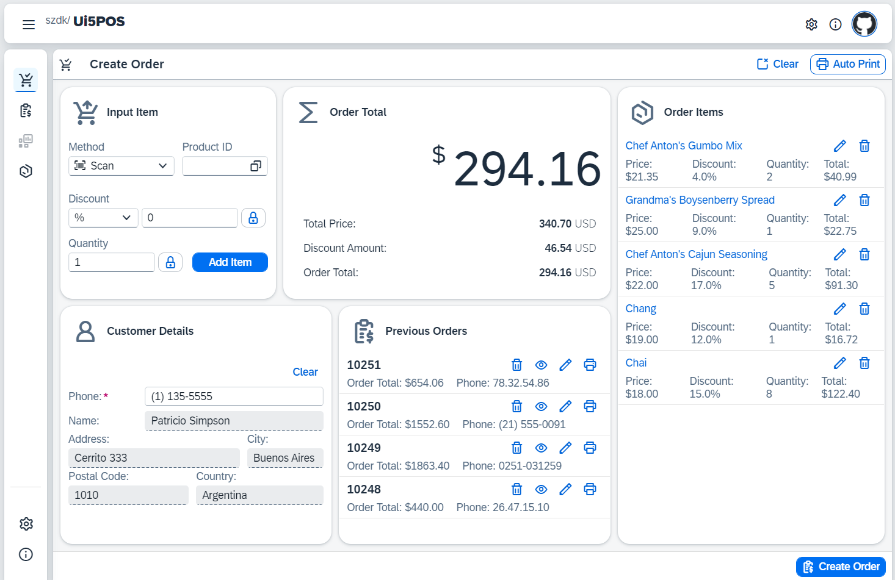

## Sample SAP Ui5 Point of Sales (PoS) App (Northwind OData, Mock Service)

This responsive POS application, built with SAP Ui5, showcases the capabilities of creating a point-of-sale solution. It leverages Northwind-like OData Services and boasts a user-friendly interface that flawlessly adapts to various devices.

See it running live at [szdk.github.io/ui5pos](https://szdk.github.io/ui5pos)

 

 
 

 

#### Key Features

* **Comprehensive Sample Functionality**: Create and manage orders, including adding and removing items, applying discounts, calculating totals, and printing receipt. Creating and managing products, categories, customers and suppliers.
* **Multilingual Support (English & Hindi)**: Supports multiple languages, with the potential for further localization
* **Themable Interface**: Different themes to visualize how you can customize the look and feel of POS application
* **Mock OData Service**: You can start this app with built in Mock OData service which mock all backend odata calls in frontend client itself 
* **Live Demo**: The full working application is hosted live on github pages which can be accessed at [szdk.github.io/ui5pos](https://szdk.github.io/ui5pos)
